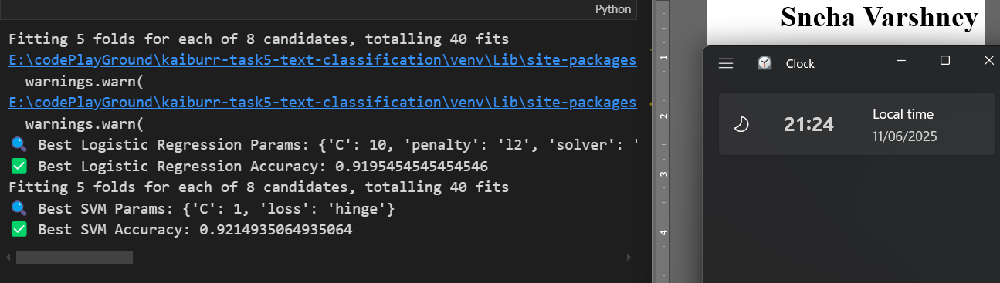

# 🧠 Consumer Complaints EDA & Classification

This is a Jupyter Notebook project that explores a filtered subset of the U.S. Consumer Financial Protection Bureau's (CFPB) consumer complaints dataset. It performs data preprocessing, visualization, and classification modeling using machine learning techniques.

---

## 🚀 Features

- Filters and remaps complaint categories into simplified labels
- Performs Exploratory Data Analysis (EDA)
- Preprocesses and cleans text data for modeling
- Trains multiple machine learning models on complaint text
- Evaluates models using classification metrics and visualizations

---

## 🛠️ Tech Stack

- Python (Jupyter Notebook)
- Libraries: `pandas`, `numpy`, `matplotlib`, `seaborn`, `scikit-learn`, `nltk`

---

## 📦 Setup Instructions

### 1. Clone or Download the Notebook

```bash
git clone https://github.com/yourusername/consumer-complaints-eda.git
cd consumer-complaints-eda
```

### 2. Set Up Environment

Install required libraries using pip or conda:

```bash
pip install pandas numpy matplotlib seaborn scikit-learn nltk
```

If using Jupyter:

```bash
jupyter notebook eda_and_modeling.ipynb
```

---

## 🧩 Dataset Summary

The original dataset contains consumer complaints on various financial products. This notebook filters and maps the dataset into **4 target categories** for classification:

| Original Product Name                               | Mapped Label                       |
| --------------------------------------------------- | ---------------------------------- |
| Credit reporting or other personal consumer reports | Credit reporting, repair, or other |
| Debt collection                                     | Debt collection                    |
| Student loan                                        | Consumer Loan                      |
| Mortgage                                            | Mortgage                           |

---

## 🔬 Notebook Structure

### 1. 📊 Part 1 — Exploratory Data Analysis

- Displays sample records
- Analyzes class distribution and word frequency

### 2. 🧹 Part 2 — Preprocessing

- Cleans text, removes stopwords, applies tokenization
- Uses `CountVectorizer` or `TF-IDF` for feature extraction

### 3. 🤖 Part 3 — Modeling

- Trains models like:
  - Logistic Regression
  - Naive Bayes
  - SVM
- Evaluates them using accuracy, precision, recall, and F1-score

### 4. 📉 Part 4 — Evaluation & Visualization

- Confusion matrix
- Bar charts for metrics comparison

---

## 📷 Output Screenshot

### 📘 Part 1: EDA — Step 1.1

### 📘 Part 1: EDA — Step 1.2

### 📘 Part 1: EDA — Step 1.3

### 📘 Part 1: EDA — Step 1.3 (Extended)

### 📘 Part 1: EDA — Step 1.4

### 📘 Part 2: Detailed Text Preprocesssing

### 📘 Part 3: Train-Test Split & TF-IDF Vectorization

### 📘 Part 4: Model Selection - Multi-Class Classifiers


### 📘 Part 5: Model Optimization — Hyperparameter Tuning

### 📘 Part 6: Comparison of Model Performance

### 📘 Part 7: Model Evaluation Using Confusion Matrix

### 📘 Part 8: Saving the Best Performing Model

### 📦 Part 9: Loading and Using the Saved Model for Prediction

### 📦 Part 10: Interactive Complaint Classifier (Console Version)

---

## 📄 References

- [CFPB Open Data Source](https://www.consumerfinance.gov/data-research/consumer-complaints/)
- [Scikit-learn Documentation](https://scikit-learn.org/stable/)
- [NLTK Official Site](https://www.nltk.org/)
- [Pandas Documentation](https://pandas.pydata.org/docs/)

---

## 👩💻 Author

Sneha Varshney  
Date Generated: 11-June-2025
